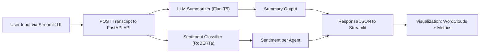

# 🧠 Agentic AI Chat Analyzer

> An AI-powered platform for analyzing agent chat transcripts about Washington Post articles using lightweight LLMs, visual EDA, and an interactive frontend.  
> Designed to summarize conversations, detect sentiments, and deliver insights — all through a modular, API-driven architecture.

---

## 🚀✨ Features
✅ Modular Data Pipeline – Clean ingestion, cleaning, and transformation

📊 EDA + Profiling – Dataset summaries, word clouds, sentiment plots

🧠 LLM Summarizer – Uses Flan-T5-small

💬 Sentiment Classification – CardiffNLP RoBERTa Sentiment

🌐 FastAPI Backend – 3 REST endpoints with Pydantic validation

🖼️ Streamlit Frontend – Interactive UI for real-time transcript analysis

📦 Model Caching – Offline-ready with locally saved models

🧪 Evaluation Pipeline – Accuracy and BLEU score metrics

---

## 🗂️ Folder Structure
```bash
Agentic_AI_ChatAnalyzer/
├── app/                # Core app logic (API, services, utils)
├── data/               # Dataset and output CSVs
├── models/             # Locally saved HuggingFace models
├── notebooks/          # EDA and profiling notebook
├── scripts/            # Model downloader and batch inference
├── streamlit_app/      # UI client (integrated with FastAPI)
├── main.py             # FastAPI entrypoint
├── requirements.txt    # Python dependencies
├── .gitignore
└── README.md
```

---

## 📐 System Architecture




---

## ⚙️ Setup Instructions

```bash
# 1. Clone the repo
git clone https://github.com/yashdew3/Agentic-AI-Chat-Analyzer.git
cd Agentic_AI_ChatAnalyzer

# 2. Create and activate environment (optional)
python -m venv venv
source venv/bin/activate   # Windows: venv\Scripts\activate

# 3. Install dependencies
pip install -r requirements.txt

# 4. Download local LLM + sentiment models (run once)
python scripts/download_models.py
```
---

## 🚀 How to Use
### Run FastAPI Backend
```bash
uvicorn main:app --reload
```
- Access Swagger Docs: http://localhost:8000/docs

---
### Run Streamlit Frontend
```bash
streamlit run streamlit_app/app_ui.py
```
- Analyze transcripts visually

- Paste chats and see live: 
    - `Summary`
    - `Sentiment Insights`
    - `Word Clouds`
    - `Article Links`
---

## 📡 API Endpoints

| Method | Endpoint     | Description                                        |
| ------ | ------------ | -------------------------------------------------- |
| GET    | `/summary`   | Returns dataset stats                              |
| POST   | `/transform` | Preprocess and clean new chat input                |
| POST   | `/insights`  | Summarizes, classifies sentiment, returns insights |

---

## 🧪 Sample API Input

### 📥 Sample Payload (for `/insights`)
```json
{
  "content": [
    {"agent": "agent_1", "message": "Let’s discuss the article on the new football rule change."},
    {"agent": "agent_2", "message": "Yes, it's causing a lot of debate on ESPN."}
  ],
  "article_url": "https://www.washingtonpost.com/sports/football-rule-change"
}

```
---

## 📈 Tech Stack

| Layer       | Tools Used                                 |
| ----------- | ------------------------------------------ |
| Backend     | FastAPI, Uvicorn, Pydantic                 |
| Frontend    | Streamlit, Matplotlib, WordCloud           |
| NLP Models  | HuggingFace Transformers: Flan-T5, RoBERTa |
| Analysis    | Pandas, Seaborn, ydata-profiling           |
| LLM Hosting | Locally saved models in `/models/`         |
---

## 🔮 Future Enhancements
- 🔐 Add JWT authentication

- 🐳 Dockerize backend & frontend for deployment

- ☁️ Deploy on Render, Railway, or HuggingFace Spaces

- 📤 Export chat reports (PDF/CSV)

- 💬 Multi-transcript support with database

---

## 📄 License
MIT License © Yash Dewangan

## ⭐ Show Your Support
If you liked this project, give it a ⭐ star on GitHub and feel free to fork it!

## 💬 Let's Connect
Feel free to connect or suggest improvements!
- Built by **Yash Dewangan**
- 🐙Github: [YashDewangan](https://github.com/yashdew3)
- 📧Email: [yashdew06@gmail.com](mailto:yashdew06@gmail.com)
- 🔗Linkedin: [YashDewangan](https://www.linkedin.com/in/yash-dewangan/)

## 🤝 Contributing
Contributions, issues, and feature requests are welcome! Feel free to check the [issues page](https://github.com/yashdew3/Agentic-AI-Chat-Analyzer/issues) (if you have one) or open a new issue to discuss changes. Pull requests are also appreciated.